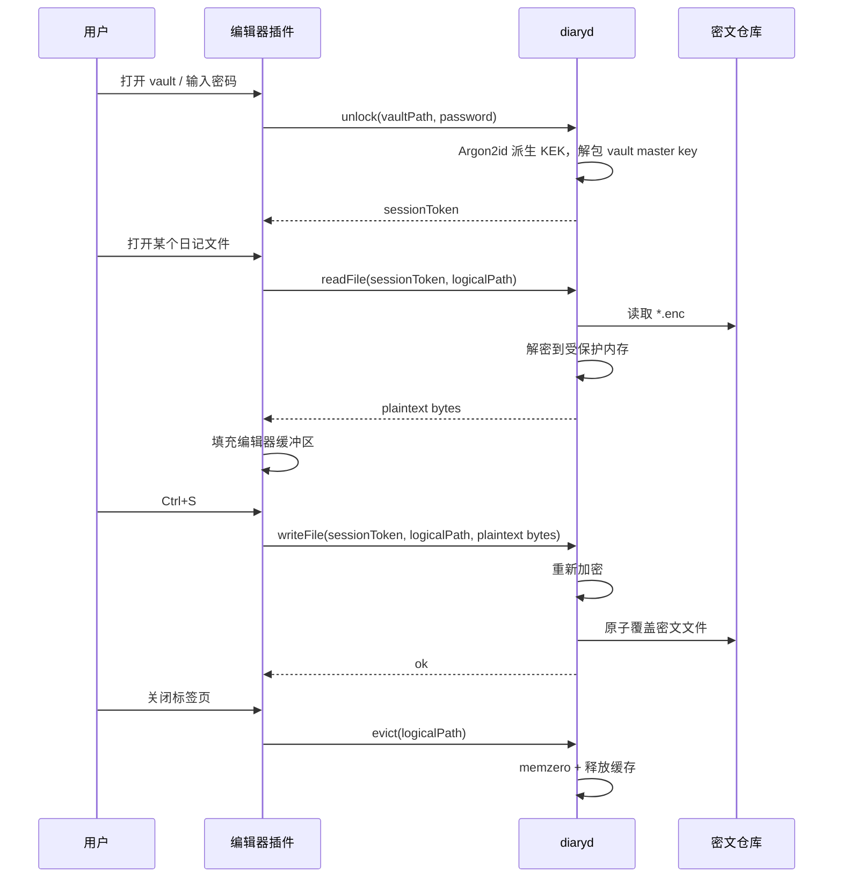
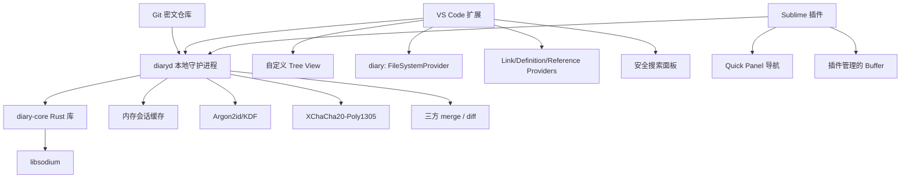
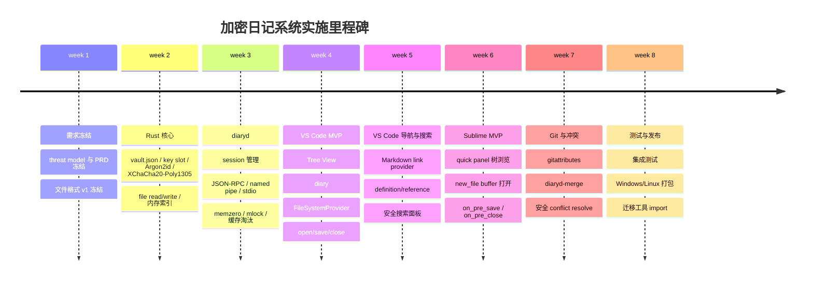

# 跨平台加密日记系统设计研究报告

## 执行摘要

这份方案建议把系统做成**编辑器原生的“密文仓库 + 虚拟明文视图”**，而不是继续走 Cryptomator 那类“解锁后把明文以虚拟盘形式暴露给整个操作系统”的路线。Cryptomator 官方文档明确说明，其解锁后会通过 WebDAV 或 FUSE 把解密后的文件作为虚拟驱动器暴露给文件管理器；这对通用文档工作流很友好，但会让明文进入更广泛的 OS 表面。你的目标恰好相反：只允许在编辑器内看到明文，且关闭编辑器后磁盘恢复为密文。citeturn14search0turn13view0

在工程上，最稳妥的主方案是：**Rust 核心加密引擎 + 本地 sidecar 守护进程 `diaryd` + VS Code 扩展 + Sublime 插件**。磁盘上保存的是 Git 可同步的密文仓库；编辑器里通过插件与 `diaryd` 通信，按需把文件解密到**编辑器缓冲区内存**；保存时重新加密覆盖磁盘密文；关闭标签页时从引擎缓存中清除、执行内存清零；全程不生成临时 `.md` 明文文件。密码学上建议使用 **Argon2id** 做密码 KDF、**XChaCha20-Poly1305** 做文件级 AEAD，主密钥随机生成后再由口令派生出来的 KEK 包裹，这样可以支持换密码、多个 key slot、以及基于主密钥的派生子密钥。Libsodium 官方明确支持密码哈希、XChaCha20-Poly1305、secure memory、以及基于单个高熵主密钥派生大量子密钥；Argon2id 也是 libsodium 默认的高层 `crypto_pwhash_*` 方案，并由 RFC 9106 标准化。citeturn26search6turn25view1turn36view0turn26search0turn0search3

最需要提前说清楚的限制在于**编辑器能力差异**。VS Code 官方提供了 `FileSystemProvider`、`DocumentLinkProvider`、`DefinitionProvider`、`ReferenceProvider` 等扩展点，足以做接近原生的虚拟文件视图和跳转能力；Sublime 官方 API 则提供 `Window.new_file/open_file`、Quick Panel、以及 `on_pre_save`、`on_pre_close` 这类事件钩子，但没有 VS Code 那类文件系统提供者扩展点。因此，VS Code 可以做到“自定义侧边栏树 + 虚拟 URI 文档 + 接近原生导航”，Sublime 更适合作为“轻量二号客户端”：通过命令面板/Quick Panel 展示解密目录树并打开插件管理的 buffer，而不应向团队承诺完整的原生虚拟侧边栏体验。citeturn43view0turn19view1turn19view0turn19view2turn42view2turn42view4turn42view0turn42view1

另一个关键结论是：**不要把 MVP 绑死在 VS Code 原生 Search 侧边栏集成上**。官方历史文档里，`TextSearchProvider`/`FileSearchProvider` 最初以 proposed API 形式出现，而 VS Code 官方又明确说明使用 proposed API 的扩展不能发布到 Marketplace。结合 virtual workspace 的限制，MVP 最稳妥的做法是：搜索先做成**扩展自带的安全搜索面板**，搜索索引只保存在内存；Phase 2 再评估是否接入原生 Search 侧边栏。citeturn40view0turn15search11turn39view0

最后，在 Git 协作方面，这个系统不应试图让 Git 理解明文；它应把**每个密文文件视为独立 blob**，并通过 `.gitattributes` + **自定义 merge driver** 解决三方合并。Git 官方文档支持自定义 merge driver；VS Code 官方文档也说明它使用机器上的 Git、并能在编辑器里完成暂存、提交和冲突解决。这意味着工程上完全可行：Git 继续管理密文仓库；插件与 `diaryd` 提供“安全 diff / merge / conflict resolve”体验。citeturn11view0turn35view0

## 目标、边界与威胁模型

你的前提非常明确：这是一套**社会意义上的加密系统**。目标是防止“任何不知道密码的人”在 Windows 或 Linux 本地、通过记事本、文件管理器、同步目录、普通搜索、普通编辑器、普通 Git 浏览等方式直接看到明文；此模型**不覆盖**内存取证、内核/管理员级恶意软件、DEBUG 附加、冷启动、交换分区取证、崩溃 dump、屏幕录制、键盘记录、以及主动绕过编辑器/插件的高级攻击。这个边界由你的需求给定，因此产品设计应把资源集中在“磁盘无明文残留、工作流顺滑、跨平台一致、Git 可用”上。citeturn36view0

在这个威胁模型下，**默认不加密目录名和文件基名**是合理的工程取舍。因为你高度重视 Git 同步、跨编辑器一致性、目录结构可读、相对链接/跳转、以及冲突处理；而像 Cryptomator 那样对文件名和目录层级做额外加密，会把目录树映射成更复杂的密文结构，并引入额外的格式演进、路径恢复和同步恢复问题。Cryptomator 的官方安全架构就展示了这种复杂性：目录 ID、AES-SIV 文件名加密、缩短名、扁平化目录存储等都存在。对你的“社会级防护”目标而言，没有必要在 MVP 复制这一层。citeturn13view2turn13view1

因此，本报告把需求拆成三个层次。第一层是**强约束**：未输入密码前无法阅读正文；磁盘不出现临时 `.md` 明文；关闭编辑器后只剩密文；Windows/Linux 一致；Git 可同步。第二层是**体验目标**：目录结构可浏览；Markdown 链接可跳转；全文搜索可用；换密码不重写全部文件；冲突可以处理。第三层是**可选增强**：文件名加密模式、附件大文件流式加密、OS keychain 记住会话、原生搜索面板集成、共享解锁会话、团队签名发布。前两层应进入 MVP/GA，第三层进入后续里程碑。citeturn43view0turn42view2turn27view2

还有一个必须明确写进 PRD 的现实约束：**“明文仅存在于编辑器内存”不只取决于你的插件，也取决于编辑器本身的备份/本地历史/会话恢复机制。** VS Code 官方文档说明 Hot Exit 会为未保存文件创建备份，本地历史默认也是开启的；Sublime 官方设置文档与官方 API/论坛说明则显示 `hot_exit` 会保存会话状态，且系统最近文件列表等行为也可能记录你打开过的文件。因此，MVP 必须把“编辑器明文残留治理”定义为一等需求，而不是部署说明里的附注。citeturn32search0turn32search1turn28search0turn31search1turn31search7turn33search2

下面这张表把几种常见路线与本需求的匹配程度作了压缩对比。

| 路线 | 明文暴露面 | Git 兼容性 | VS Code 体验 | Sublime 体验 | 结论 |
|---|---|---:|---:|---:|---|
| Cryptomator/FUSE/WebDAV 挂载 | OS 级虚拟盘可见，明文对更多应用可见 citeturn14search0 | 高 | 高 | 高 | 不符合“只在编辑器内看到明文” |
| 纯虚拟工作区 `diary://` | 明文仅在编辑器/扩展侧 | 中，原生 Git UI 受限，因为 Git 依赖真实文件系统工作区 citeturn35view0turn39view0 | 高 | 低 | 适合作为可选安全模式 |
| 真实密文仓库 + 插件虚拟树/虚拟文档 | 明文仅在插件和编辑器内存；磁盘始终为密文 | 高 | 高 | 中 | **推荐主方案** |
| 临时明文解压到工作目录 | 明文落盘 | 高 | 高 | 高 | 直接排除 |

## 产品需求与用户工作流

从 PRD 角度，产品对象可以定义为：**个人本地 Markdown 日记仓库**，但设计应留出向“私密知识库/研究笔记库”扩展的空间。因为 VS Code 的 Markdown 导航能力、Sublime 的文本编辑能力，以及 Git 的分支/冲突模型，都天然支持“多目录、多年份、多主题、多交叉链接”的内容组织。VS Code 官方确实提供了语言/文档级的链接与跳转扩展能力，Sublime 官方 API 则提供了命令面板、Quick Panel 和视图生命周期钩子，足以支撑一个工程化的私密笔记客户端。citeturn19view1turn19view0turn19view2turn42view4turn42view0turn42view1

MVP 的用户旅程建议设计成这样：用户把一个 Git 仓库当作“密文仓库”打开；在 VS Code 中，扩展侧边栏显示一个“解密后的目录树”，点击节点时打开 `diary:` URI 文档；在 Sublime 中，运行“Open Encrypted Diary File”命令后，通过 Quick Panel 层层进入目录并打开 buffer。初次访问 vault 时输入密码，`diaryd` 解锁主密钥并缓存会话；之后在同一编辑器会话内打开多个文件不再重复输入密码。文件被修改后，保存动作触发加密重写磁盘上的密文文件；标签页关闭时，插件通知引擎执行缓存淘汰和内存清零。citeturn43view0turn42view2turn42view4turn36view0

这套旅程里最重要的 UX 决策是：**“保存”必须等价于“重新加密并刷盘”，而不是“先保存到明文临时文件，再异步加密”**。这是整个系统的红线。只要出现明文临时刷盘，需求就从根上失效。Libsodium 官方对 secure memory 的说明也强调了 `sodium_memzero()`、`sodium_mlock()`、`sodium_malloc()` 之类能力的用途就是避免敏感数据被交换到磁盘或在释放后残留；你的系统虽然不对抗高级攻击，但仍然应把这些作为 defense-in-depth。citeturn36view0

对“搜索”和“跳转”，建议在 PRD 里分为两类。其一是**文档内/文档间跳转**：Markdown 相对链接、wiki-link、标题跳转、backlinks、引用查找。VS Code 可以依赖 `DocumentLinkProvider`、`DefinitionProvider`、`ReferenceProvider` 完成；Sublime 则通过命令和 quick panel 做等价体验。其二是**全文搜索**：MVP 采用内存索引，命中结果后打开对应 `diary:` 文档或 Sublime buffer，并定位到行列。这样可以在不落盘的前提下给出足够强的搜索体验。citeturn19view1turn19view0turn19view2turn42view4

为了让工程团队实现时不走弯路，建议把 VS Code 和 Sublime 的可达成 UX 明确分层：

| 能力 | VS Code | Sublime | 备注 |
|---|---|---|---|
| 解锁后浏览目录树 | 扩展侧边栏 Tree View + `diary:` URI，体验可接近原生 citeturn43view0turn39view0 | Quick Panel / Command Palette 树浏览 citeturn42view4turn42view2 | 这是由官方 API 差异决定的 |
| 打开后 Markdown 编辑 | 强 | 强 | 两者都可以 |
| 文档链接跳转 | 强，直接做 provider citeturn19view1turn19view0 | 中，命令式实现 | |
| 全文搜索 | 强，扩展内安全搜索面板 | 中，插件搜索面板 | MVP 不依赖 VS Code 原生 Search provider |
| 原生 Git UI | 强，真实密文仓库工作区下可直接使用 citeturn35view0 | 中，更多依赖外部 Git/Sublime Merge | |

下面给出推荐的打开—编辑—保存—关闭时序，便于 Codex/工程团队把责任边界定死。



## 技术架构

推荐架构是一个**单一 Rust 核心仓**，对外暴露两层接口：底层是 `diary-core` 库，包含密码学、文件格式、路径规范化、索引、merge、search 等能力；上层是本地 sidecar 进程 `diaryd`，承担会话管理、内存缓存、受保护堆分配、跨编辑器复用和 IPC。这样设计的主要原因是，VS Code 扩展运行在 extension host 里，而 VS Code 官方说明扩展主机拥有与 VS Code 自身相同的权限，并且可以运行外部进程；同时，VS Code 官方的 Language Server 指南也强调，把重 CPU / 内存的逻辑放到独立进程可以降低对编辑器性能的影响。citeturn20view0turn24view0

就运行时路线而言，建议把**Rust sidecar 作为唯一正式生产运行时**，把 `napi-rs` 和 WASM 都降格为“可选接入层”，而不是主路径。Node-API 官方文档强调其 ABI 稳定性，确实非常适合构建 VS Code 的原生模块；但它无法直接解决 Sublime/Python 插件端复用的问题。WASM 虽然跨平台，但对 Argon2、secure memory、以及本地文件系统/本地进程协作都不够理想。综合来看，统一的 Rust sidecar 更符合“一个引擎，两种编辑器客户端”的目标。citeturn22search0turn22search10turn18search1

| 方案 | 优点 | 缺点 | 适用结论 |
|---|---|---|---|
| Rust sidecar CLI/daemon | 两个编辑器共用；便于 secure memory；崩溃隔离；语言无关 IPC | 需要进程管理与 IPC 协议 | **主方案** |
| VS Code `napi-rs` 原生模块 | 调用延迟低；可复用 Node-API ABI 稳定性 citeturn22search0 | 难复用到 Sublime；仍在编辑器进程内 | 可做 Phase 2 优化 |
| WASM | 分发简单；理论跨环境 | KDF/大文件/安全内存都弱；桌面本地价值有限 | 不建议做桌面主运行时 |
| TypeScript/ Python 纯实现 | 开发快 | 密码学/性能/内存治理都弱于 Rust + libsodium | 不建议 |

推荐的组件边界如下图所示：



VS Code 端不建议把整个 vault 直接作为“纯虚拟工作区”打开。虽然官方确实支持 `FileSystemProvider`，甚至允许通过 `--folder-uri` 打开 URI 作为文件夹，但 virtual workspace 官方指南也明确提醒：并非所有扩展都能在虚拟资源上正常工作，而且某些语言/工具只能提供单文件级支持。更重要的是，内建 Git 需要真实磁盘工作区。由于 VS Code 的 Git 功能使用的是机器上的 Git 安装，因此**主模式**应是“打开真实密文仓库，再由扩展提供解密目录树和 `diary:` 文档”；`--folder-uri diary://...` 可作为可选的“纯安全浏览模式”。citeturn43view0turn39view0turn40view0turn35view0

Sublime 端则应接受平台能力边界：官方 API 提供 `Window.new_file`、Quick Panel、以及 `on_pre_save`、`on_pre_close` 等生命周期事件，但并没有 VS Code 那种文件系统提供者抽象。因此，Sublime 的推荐架构是“**命令驱动式打开 + 插件管理的临时 view/buffer**”。打开时用 `new_file()` 创建 view，设置名字和 Markdown syntax，并在 view settings 中写入 ciphertext 路径、vault id、session id；保存与关闭通过事件钩子和专用命令接管。citeturn42view2turn42view0turn42view1

IPC 协议建议使用**本地 JSON-RPC 2.0 风格消息**，优先采用 Unix domain socket / Windows named pipe；若平台封装复杂度要降到最低，MVP 也可以用 stdio 子进程模式。接口层应显式区分“会话级 API”“文件级 API”“索引级 API”“Git/merge API”，并禁止插件直接访问明文文件系统路径。这样做的目标是让编辑器端永远只拿到**字节数组 / 虚拟 URI / 查询结果**，不接触“明文工作目录”这一概念。这个边界在系统设计上比任何单个算法选择都更重要。citeturn20view0turn24view0

## 密码学、文件格式与索引

密码学建议非常明确：**口令不直接作为文件加密密钥使用**。正确结构应是：创建 vault 时先随机生成 256-bit `vault_master_key`；用户口令通过 **Argon2id** 派生出 KEK；用 KEK 去包裹 `vault_master_key` 并写入 `vault.json` 的一个或多个 key slot；各文件再基于 `vault_master_key` 派生文件级子密钥，配合 **XChaCha20-Poly1305** 做 AEAD。这样一来，密码修改只需要重包裹 master key，不需要重写所有文件。Libsodium 官方文档明确给出了 `crypto_pwhash_*`、`crypto_kdf`、`crypto_aead_xchacha20poly1305_ietf_*` 的能力边界和使用方式。citeturn26search6turn26search4turn26search0turn25view1

Argon2 参数不应写死一个绝对值，而应采用**首启校准 + 策略下限**。理由很简单：你的机器配置跨度可能从普通笔记本到高内存 Linux 设备，而 Argon2 本来就是时间/内存可调的 KDF。工程上建议默认策略为“目标 250–750ms 解锁延迟，最小 64 MiB 内存、3 次迭代、并行度按 CPU 核数或固定 1–4 校准”，并把最终参数记录到 `vault.json` 中。这样既遵循 Argon2id 的设计意图，又兼顾跨平台体验。Argon2id 的标准化来自 RFC 9106，而 libsodium 当前高层 `crypto_pwhash_*` 默认就在各平台使用 Argon2id。citeturn0search3turn26search6turn26search4

文件级加密建议采用 **single-file AEAD** 作为 Markdown 文本文件的 MVP 格式。因为 `.md` 日记文件通常不大，打开和保存都是“整文件进出编辑器缓冲区”，没有必要在文本 MVP 里优先上 secretstream。对超大附件或未来富文本资源，再进入 chunked streaming 格式更合理。XChaCha20-Poly1305 的优势在于 nonce 足够长，libsodium 官方明确说明 192-bit nonce 下为每条消息随机生成 nonce 是可接受的，并且可以把附加数据 `ad` 一并认证。citeturn25view1turn25view0

推荐的磁盘文件命名是：**保留目录树与基名，追加密文后缀**。例如 `2026/07/2026-07-10.md.enc`。这样做的好处是：Git 路径稳定、跨编辑器路径一致、目录树可读、相对链接的逻辑路径清晰。代价是会泄露文件名和目录名，但在你的 threat model 下这是可接受的。若未来需要更强的元数据保护，可以追加“文件名加密模式”，但应作为非默认高级模式。citeturn13view2turn13view1

推荐文件格式如下：

```text
<logical-path>.md.enc

magic        = "EDRY"
version      = 1
header_len   = u16
header       = CBOR({
  file_id: uuid,
  cipher: "XCHACHA20-POLY1305-IETF",
  nonce: 24 bytes,
  key_slot: 1,
  plaintext_kind: "markdown",
  created_at: unix_ms,
  modified_at: unix_ms,
  flags: bitset,
  reserved: ...
})
ciphertext   = AEAD_Encrypt(
  key = derive_subkey(vault_master_key, file_id),
  nonce = header.nonce,
  aad = canonical(header minus mutable display-only fields),
  plaintext = utf8(markdown_content)
)
```

`vault.json` 示例：

```json
{
  "version": 1,
  "vaultId": "7b9aa4d2-7f30-4d42-b57b-7fd4c155abcd",
  "kdf": {
    "algorithm": "argon2id",
    "memKiB": 65536,
    "timeCost": 3,
    "parallelism": 1,
    "salt": "base64..."
  },
  "wrapping": {
    "algorithm": "xchacha20poly1305-ietf",
    "nonce": "base64..."
  },
  "keySlots": [
    {
      "slot": 1,
      "type": "password",
      "wrappedMasterKey": "base64..."
    }
  ],
  "features": {
    "filenameEncryption": false,
    "streamingBlobs": false
  }
}
```

关于索引，建议把方案明确分成两条路线并给出主推荐：

| 搜索路线 | 磁盘泄露面 | 打开速度 | 搜索速度 | 实现复杂度 | 结论 |
|---|---:|---:|---:|---:|---|
| 纯内存索引 | 最低 | 解锁后需要建索引 | 高 | 中 | **MVP 推荐** |
| 加密落盘索引 | 有额外元数据设计负担 | 更快 | 高 | 高 | Phase 2，且仅在大仓库下考虑 |
| 无索引、逐文件扫描 | 最低 | 无前置成本 | 低 | 低 | 只适合很小 vault |

之所以推荐纯内存索引，是因为它最符合“明文只在编辑器内存”的系统哲学。解锁后由 `diaryd` 扫描密文仓库、逐文件解密并构建倒排索引或 trigram 索引；锁定或退出时索引整体销毁并清零。搜索结果只返回逻辑路径、行列范围、少量上下文片段。若未来 vault 很大，再引入“加密 cache index”也不迟。citeturn36view0turn25view1

值得在 PRD 里额外加一条硬化说明：即便你不考虑高级攻击，`diaryd` 也应尽量把 master key、已打开文件的明文缓存、以及解锁口令放在 `sodium_malloc` / `sodium_mlock` 管理的受保护内存里，并在会话结束后使用 `sodium_memzero` / `sodium_munlock` 处理。Libsodium 官方也明确提醒这只是 defense-in-depth，不能替代全盘加密和 swap/hibernation 管理；但在你的边界内，这已经足够合理。citeturn36view0

## 编辑器集成与插件 API 设计

VS Code 端建议实现四类能力：**自定义树视图、虚拟文档、导航 provider、安全搜索面板**。其中最关键的是虚拟文档与自定义树视图：树视图负责“展示解密后的目录结构”，点击节点时打开 `diary:` scheme 文档；文档真正的读写则走 `workspace.registerFileSystemProvider` 提供的自定义文件系统。VS Code 官方 API 明确支持通过 scheme 注册 `FileSystemProvider`，并将其作为读写/发现/管理文件夹的统一抽象。citeturn43view0turn43view1

导航层则建立在 `DocumentLinkProvider`、`DefinitionProvider`、`ReferenceProvider` 上。Markdown 中的相对链接、锚点、wiki-link，都应在 `diary:` scheme 下解析成逻辑路径并返回可点击目标。VS Code 官方 API 说明这些 provider 都是可注册的，而且会被编辑器用来支撑“文档链接”“跳转定义”“查找引用”等能力。对 Markdown 日记而言，这足够构建“内部双链笔记库”的核心体验。citeturn19view1turn19view0turn19view2

但必须额外加上**编辑器明文残留治理**。VS Code 官方文档说明 Hot Exit 会为未保存变更创建备份；本地历史默认也是开启的；Custom Editor API 也明确提到备份与 hot exit 的关系。因此在系统设计上应采用“双保险”：一方面，`diary:` 资源不走任何明文落盘备份实现；另一方面，扩展在首次启用 vault 时必须检测并引导用户为该 profile / 工作区关闭 `files.hotExit`，并关闭或排除 vault 的 `workbench.localHistory`。如果用户拒绝这些设置，应在状态栏和首次向导里清楚提示“不能保证磁盘无明文历史”。citeturn32search0turn32search1turn32search8turn34view1

同时，VS Code 的工作区能力也需要在 manifest 中清晰表达。由于你的扩展要处理虚拟 URI，官方 virtual workspace 指南要求扩展认真处理非 `file` scheme，并通过 `capabilities.virtualWorkspaces` 申明支持程度；另外，如果扩展需要访问本地设备、拉起本地守护进程，则应优先在本地 UI 侧运行。官方扩展宿主文档提供了 `extensionKind` 的声明方式；Workspace Trust 指南则给出了 `untrustedWorkspaces` 的声明模型。对这个项目，推荐 `extensionKind: ["ui"]`，`virtualWorkspaces: true`，`untrustedWorkspaces: false` 或 `"limited"`。citeturn39view0turn38search7turn38search5

Sublime 端建议做成**命令式客户端**，而不是试图模拟真实文件系统。官方 API 明确提供了 `Window.new_file()`、`Window.open_file()`、Quick Panel，以及 `on_pre_save`、`on_pre_close` 事件；这很适合做“插件托管 buffer”的模式。具体上，插件在文件打开时创建一个新的 view，设置 Markdown 语法和逻辑路径名称；在 view settings 中记录 `cipher_path`、`vault_id`、`session_id`、`logical_path`；用户按保存时，`on_pre_save` 不允许 Sublime 把明文写回普通路径，而是改为调用 `diaryd.writeFile` 并阻断默认保存路径语义；用户关闭 view 时，`on_pre_close` 通知引擎清理缓存。citeturn42view2turn42view0turn42view1

Sublime 还有两个必须写进产品要求的安全限制。其一，官方 API 中 `set_scratch(True)` 会使关闭时不提示保存且不标记 dirty，这与安全文本编辑器的预期并不一致，因此**不要**把核心明文编辑 view 设计成 scratch buffer；应保留 dirty 语义，只是把保存动作接管到插件命令。其二，Sublime 的 `hot_exit`、会话恢复、以及系统最近文件列表可能留下行为痕迹，因此安装向导必须提示用户关闭 `hot_exit`、限制 session 行为，并把 `update_system_recent_files` 关闭到符合你要求的程度。官方设置文档把 `hot_exit` 归为应用级行为设置；官方 API 也说明 scratch buffer 的关闭行为；Sublime 官方发布说明里还专门提到了 `update_system_recent_files`。citeturn42view3turn31search1turn31search7turn33search2

下面给出一个建议的 IPC/插件 API 契约，便于工程团队并行开发：

```json
{"jsonrpc":"2.0","id":1,"method":"vault.unlock","params":{
  "vaultPath":"/repo/journal",
  "password":"***"
}}

{"jsonrpc":"2.0","id":2,"method":"vault.listTree","params":{
  "session":"sess_abc",
  "prefix":"2026/"
}}

{"jsonrpc":"2.0","id":3,"method":"file.read","params":{
  "session":"sess_abc",
  "logicalPath":"2026/07/2026-07-10.md"
}}

{"jsonrpc":"2.0","id":4,"method":"file.write","params":{
  "session":"sess_abc",
  "logicalPath":"2026/07/2026-07-10.md",
  "contentBase64":"....",
  "etag":"sha256:..."
}}

{"jsonrpc":"2.0","id":5,"method":"search.query","params":{
  "session":"sess_abc",
  "query":"强化学习",
  "limit":50
}}

{"jsonrpc":"2.0","id":6,"method":"git.mergePrepare","params":{
  "session":"sess_abc",
  "ancestor":"/tmp/%O",
  "current":"/tmp/%A",
  "incoming":"/tmp/%B",
  "logicalPath":"2026/07/2026-07-10.md"
}}
```

样例目录布局如下：

```text
journal/
  .gitattributes
  .gitignore
  vault.json
  2024/
    2024-12/
      2024-12-31.md.enc
  2025/
    2025-07/
      2025-07-01.md.enc
      2025-07-02.md.enc
  topics/
    rl/
      notes.md.enc
  .vault-local/          # gitignore
    sessions/
    logs/
    cache/
```

`.gitattributes` 建议：

```gitattributes
*.md.enc -text -diff merge=ediary
```

`git config` 示例：

```ini
[merge "ediary"]
    name = encrypted diary 3-way merge
    driver = diaryd-merge %O %A %B
```

Git 官方文档支持通过 `.gitattributes` 配置自定义 merge driver；若你把文件声明为纯 `binary`，Git 会关闭文本合并，因此这里不应直接套用 `binary` 宏，而应显式写 `-text -diff merge=...`。citeturn11view0

## Git、测试、交付与迁移

Git 集成的原则应当是：**Git 只管理密文，插件只管理明文视图。** VS Code 官方文档说明其 Git 集成依赖机器上的 Git，并会在打开 Git 仓库时自动启用源码管理功能；这正适合你的系统，因为每次保存都会把逻辑文件重新加密覆盖，从而让 Git 看到的是稳定的密文 blob 变化。Git 层面不要尝试使用普通文本 diff；用户若需要明文级 diff/merge，由插件调用 `diaryd` 做专门的安全视图即可。citeturn35view0

冲突处理应采用**自定义 merge driver + 安全冲突文件**。流程建议是：Git 在三方合并时调用 `diaryd-merge`；merge driver 解密 `%O/%A/%B` 到内存，执行标准 diff3；若自动合并成功，则将结果重新加密写回 `%A`；若失败，则把带冲突标记的合并结果重新加密写回 `%A`，并在 header flag 或 sidecar 元数据中标注 `hasConflicts=true`。之后插件打开该文件时，以明文形式显示冲突标记，让用户在编辑器里解决，再保存回密文。这样可以保证**连冲突状态也不落盘为明文**。Git 自定义 merge driver 官方支持这种模式。citeturn11view0

测试计划应分成四层。第一层是**密码学与格式单元测试**：KDF 参数序列化、nonce 唯一性、错误密码失败、损坏 header 失败、AAD 被篡改失败、换密码不重写正文。第二层是**性质测试/属性测试**：任意 UTF-8 Markdown 文本经加密解密后等价；任意保存-重载-重命名-再保存序列都保持一致。第三层是**编辑器集成测试**：VS Code 官方支持在 Extension Development Host 中运行集成测试，你可以直接把打开/编辑/保存/关闭/搜索/跳转编排成测试案例。第四层是**端到端工作流测试**：Git 合并、冲突修复、跨平台换行、中文文件名、长路径、崩溃恢复策略。VS Code 官方对扩展测试有明确文档；Sublime 没有同级别官方集成测试框架，因此建议把高价值自动化尽量放到 `diary-core` 和 `diaryd` 层，Sublime 端做 smoke test + 手工回归矩阵。citeturn27view4turn24view0

CI/CD 方面，VS Code 官方支持使用 `vsce package` 生成 VSIX，也支持平台特定扩展；官方 CI 文档说明可以通过 `VSCE_PAT` 在流水线中自动发布。对这个项目，建议使用 GitHub Actions 或同类矩阵流水线：分别构建 `diaryd` for `win32-x64`、`win32-arm64`、`linux-x64`、`linux-arm64`；再把对应二进制打进平台特定 VSIX 中。Sublime 端则通过 Package Control 私有仓库或内部 channel 发布，Package Control 官方文档也说明了 channel/repository 结构以及依赖包可携带二进制/共享库。citeturn27view0turn27view1turn27view2turn21view1turn21view0turn21view3

发布策略建议采用“两条线”。第一条是**内部稳定线**：私人使用或小范围团队测试，VS Code 用私有 VSIX，Sublime 用私有 channel；这一阶段允许 UI 与格式迭代较快。第二条是**外部可安装线**：只有当格式兼容策略、merge driver、升级流程、错误恢复都稳定后，再考虑 VS Code Marketplace 和 Package Control 正式分发。VS Code 官方文档还支持预发布版本和平台特定包，这很适合你在“格式冻结前”做灰度。citeturn27view2turn27view0

从“Cryptomator 路线”迁移到本方案，迁移工具应是一个正式交付件，而不是脚本附赠。原因很直接：Cryptomator 官方文档显示其 vault 结构和文件名加密方案较复杂，而且其本质是把解密结果挂载成虚拟驱动器；你要迁移的其实是“工作方式”，不是简单的“改后缀”。建议的迁移路线是：先在离线环境解锁旧方案/挂载旧 vault；运行 `diary import` 扫描明文树；把每个 Markdown 明文写成新格式 `*.md.enc`；生成 `vault.json`；校验文件计数、路径、内容 hash；最后把新仓库第一次提交到 Git，并把旧 vault 设为只读归档。citeturn14search0turn13view1turn13view2

若用户当前并不真的在用 Cryptomator，只是“思路像 Cryptomator”，那迁移会更简单：直接对现有 plaintext Markdown 仓库运行一次 `diary import --from-plaintext` 即可。为了降低风险，工具必须支持三种模式：`dry-run`、`copy-import`、`in-place-convert`。其中默认只应启用 `copy-import`；`in-place-convert` 必须要求显式二次确认。这个迁移策略和你“社会级防护”的目标一致：优先降低误操作和数据丢失，而不是追求一次性极致自动化。citeturn14search0turn13view1

最后给出一份建议的实施时间线，便于工程团队拆 Sprint：



综合以上分析，**推荐交付形态**可以用一句话概括：**一个真实的 Git 密文仓库，外加一个本地 Rust 解密引擎，以及 VS Code / Sublime 的“明文视图插件”**。它精准满足“未输入密码不能读、记事本只见乱码、原文不生成临时文件、目录结构可呈现、可搜索、可跳转、可 Git 同步”的核心诉求，同时又尊重了 VS Code 与 Sublime 官方 API 的真实能力边界。citeturn43view0turn35view0turn42view2turn42view0turn26search6turn25view1